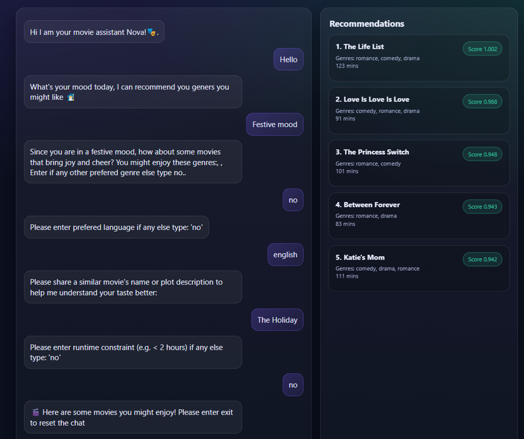

# 🎬 Movie Recommendation Engine

## Sample Recommendations

  

## How It Works
- User input → preference extraction -> It detects the mood based on user's input and recommends genres extracts additional preferences
- Semantic search using FAISS
- Re-ranking with soft constraints
- I have integrated LLMs: like Gemini API to process some ambigous user responses
- to run the app > uvicorn app.main:app --reload

UI → http://127.0.0.1:8000/
